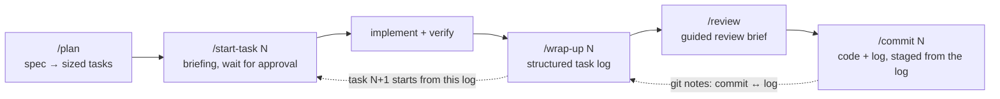

# Casefile

**AI-assisted development that `git blame` can explain.**

> *casefile — the file a lawyer keeps on their own side of the desk, deliberately separate from the official record.*

Run in [native-federation/devtools](https://github.com/native-federation/devtools), a repo built with casefile:

```
$ casefile why projects/devtools-ui/src/app/app.html:7 --head 8
projects/devtools-ui/src/app/app.html:7 -> bae1956e (task-4: hide the Diagnostics tab)
tasklog: docs/work/graph-view/task-log/task-4-hide-diagnostics-tab.md (co-committed)
  ### Task

  Presentation-only nav change: the Diagnostics entry is removed from the
  panel navigation while the placeholder route stays reachable by direct
  URL (no redirect); the existing app/shell pins are extended in place and
  source comments record that the tab returns when resolution-model
  Task 10 (canonical Diagnostics) lands.

  … (177 more lines: git show bae1956e:docs/work/graph-view/task-log/task-4-hide-diagnostics-tab.md)
```

One command answered *why the Diagnostics tab is hidden* — and when it
comes back. The answer was not written for this question. It is the task
log that was committed together with the change, found via `git blame`.
Reading provenance needs no AI: plain git and a single-file Python CLI.

## Every commit carries its case

Each task ends with one structured log: what changed and why, key
decisions with the alternatives that were rejected, test evidence,
acceptance coverage, open issues, and context for the next task. The log
competes with no ticket system — it holds exactly what is written down
nowhere else, and it is linked to the commit that made the change.

The chain runs one layer deeper: closing a task also archives the **raw
agent-session transcripts** that produced it — listed in the log's
Sessions section, stored next to the log in the private casefile repo
(in both modes), never in the code repo. The log is the curated record;
the transcript is the evidence behind it, kept before the agent tool
expires it.

| | **Home mode** | **Casefile mode** |
|---|---|---|
| Artifacts live | `docs/work/<scope>/` inside the repo | a private casefile repo outside it |
| Commit ↔ log link | log committed next to the code | git notes (never pushed to origin) |
| For | your own projects | client / regulated repos — zero footprint |

In casefile mode the commit ↔ log link lives in **local git notes**:
the client repo never sees the logs *or* the notes ref — `casefile
link` pushes its notes backup into the private casefile only. On the
operator's machine it looks like this
([native-federation-website](https://github.com/native-federation/native-federation-website)
is developed in casefile mode):

```
$ git log -1 --show-notes --format=short 4bf926e
commit 4bf926eb9a768d08ec2f12276b4b8800bbf824a7
Author: Lutz Leonhardt <kontakt@lutzleonhardt.de>

    feat: link the published Chrome Web Store listing

Notes:
    tasklog: native-federation/native-federation-website/work/webstore-link/task-log/feat-add-link-to-store.md
```

The [same commit on GitHub](https://github.com/native-federation/native-federation-website/commit/4bf926eb9a768d08ec2f12276b4b8800bbf824a7)
shows no note, and the repo carries no work directory at all. Unlike
the demo at the top, this one is deliberately *not* reproducible from
a clone: the provenance never left the operator's machine. Two edge
cases to know:

- **A fresh clone has no notes.** Notes do not travel with
  `git clone`; the links are still safe — every `casefile link`
  backs the notes ref up into the casefile repo, `casefile doctor`
  flags the gap after a re-clone, `casefile restore` brings them back.
- **Squash and rebase merges break the link.** Both mint new commits
  server-side, so the noted commit never reaches `main`. Merge
  commits (and fast-forwards) are safe: they keep the original SHAs —
  and `git blame` attributes lines to those, exactly where the notes
  hang.

## Tasks build on the record

The second half of the system is the loop that writes those logs. A spec
is sliced into isolated, commit-sized tasks; each new task starts by
reading its predecessor's log — not the whole history, not the sibling
tasks.



Anthropic's [AI-Native SDLC playbook](https://claude.com/blog/the-ai-native-sdlc-playbook)
chains versioned artifacts forward — intent, spec, plan, diff, review
findings — and keeps standing knowledge in a deliberately short
`CLAUDE.md`. Casefile adds the layer both leave out: history. `CLAUDE.md`
holds state, not the reasons; the playbook's artifacts trace a feature
forward, but nothing routes from a line of code back to the decision
behind it, or hands one task's discoveries to the next. One log per
task, linked to its commit, does both.

## Install

```sh
curl -fsSL https://raw.githubusercontent.com/lutzleonhardt/casefile/main/install.sh | sh
casefile skills install
```

The first line installs the `casefile` CLI (single-file Python, stdlib
only) to `~/.local/bin` — nothing else. The second, deliberately
separate, writes the six skills for the agents it finds — Claude Code
(`~/.claude/skills/`) and Codex (`~/.codex/skills/`) — overwriting
those six names. Both scripts are short — read them first. Re-running
either is the update.

## The skills

| Skill | Job |
|---|---|
| `/plan` | Slice a spec into right-sized, testable tasks; key locations verified against the code; writes only after approval. |
| `/start-task N` | Brief the task from the plan block, the predecessor log, and bounded history — then wait for approval. |
| `/wrap-up N` | Write or extend the task log; merges across sessions; records plan deviations; handles BLOCKED with a re-plan. |
| `/review` | Guided review brief — quick per task, full before a PR, coverage for large diffs. Cross-checks the log's claims. |
| `/commit N` | Stage code + log from the log's own record, show the plan, commit after confirmation; casefile mode links via git notes. |
| `/why FILE:LINE` | The demo above, as a skill: blame → commit → log → answer, with the evidence chain cited. |

## Evidence

devtools is developed with casefile in home mode, in the open: browse
the [task logs](https://github.com/native-federation/devtools/tree/main/docs/work/resolution-model/task-log)
or a [single commit](https://github.com/native-federation/devtools/commit/76eca17)
carrying code, design doc, and log together. The demo at the top is
reproducible: clone devtools, install casefile, run the command.

## Status

A reference setup, extracted from daily use — not a framework looking
for users. Read the skills, adapt them, keep what earns its place.
Issues and discussion welcome; roadmap promises not included.

Built by [Lutz Leonhardt](https://github.com/lutzleonhardt). MIT.
